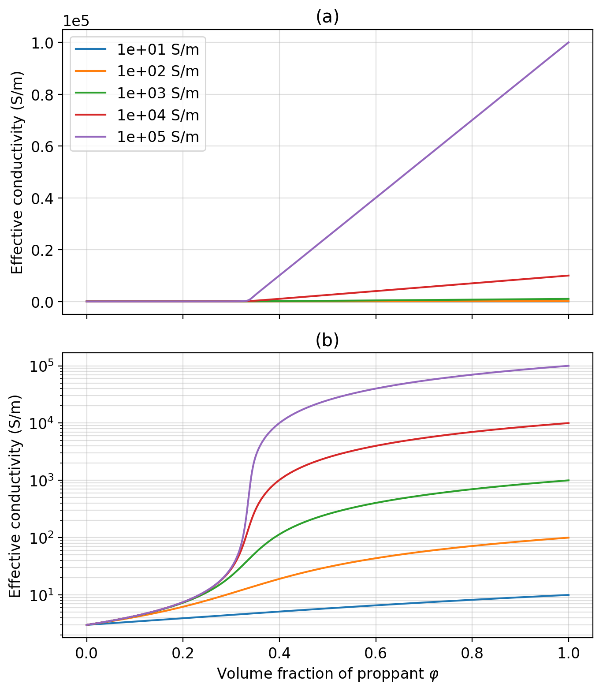

**[summary](#summary) | [contents](#contents) | [usage](#usage) | [running the notebooks](#running-the-notebooks) | [issues](#issues) | [citation](#citation) | [license](#license)**

# A physical property model for a fractured volume of rock

[](https://travis-ci.org/simpeg-research/heagy-2018-fracture-physprops)
[](https://mybinder.org/v2/gh/simpeg-research/heagy-2018-fracture-physprops/master)
[](https://notebooks.azure.com/import/gh/simpeg-research/heagy-2018-fracture-physprops)
[](https://github.com/simpeg-research/heagy-2018-fracture-physprops/blob/master/LICENSE)
[](http://simpeg.xyz)

## Summary

This repository contains the notebooks used to generate the examples shown in Chapter 2
of the thesis "Electromagnetic methods for imaging subsurface injections" by [Lindsey J. Heagy](https://github.com/lheagy)



## Contents

- [notebooks](notebooks): contains the notebooks used to generate figures in the paper
    - [1_TDEM_Comparison_w_Commer](notebooks/1_TDEM_Comparison_w_Commer.ipynb): Figures 3 and 4
    - [2_DC_Kaufman_infinite_well](notebooks/2_DC_Kaufman_infinite_well.ipynb): Figure 5
    - [3_DC_Kaufman_finite_well](notebooks/3_DC_Kaufman_finite_well.ipynb): Figure 6
    - [4_TDEM_current_plots](notebooks/4_TDEM_current_plots.ipynb): Figure 7
    - [5_FDEM_following_Augustin_Fig3](notebooks/5_FDEM_following_Augustin_Fig3.ipynb): Figures 8 - 10
    - [6_FDEM_Permeability](notebooks/6_FDEM_Permeability.ipynb): Figures 11 and 12
    - [7_TDEM_Permeability](notebooks/7_TDEM_Permeability.ipynb): Figures 13 and 14

## Usage

### Online
The notebooks can be run online through [mybinder](https://mybinder.org/v2/gh/simpeg-research/heagy-2018-fracture-physprops/master) or [azure notebooks](https://notebooks.azure.com/import/gh/simpeg-research/heagy-2018-fracture-physprops).

### Locally
To run them locally, you will need to have python installed, preferably through [anaconda](https://www.anaconda.com/download/).

You can then clone this reposiroty. From a command line, run

```
git clone https://github.com/simpeg-research/heagy-2018-fracture-physprops.git
```

Then `cd` into the `heagy-2018-fracture-physprops`

```
cd heagy-2018-fracture-physprops
```

To setup your software environment, we recommend you use the provided conda environment

```
conda env create -f environment.yml
source activate fracture-physprops-environment
```

alternatively, you can install dependencies through pypi
```
pip install -r requirements.txt
```

You can then launch Jupyter
```
jupyter notebook
```

Jupyter will then launch in your web-browser.

## Running the notebooks

Each cell of code can be run with `shift + enter` or you can run the entire notebook by selecting `cell`, `Run All` in the toolbar.


For more information on running Jupyter notebooks, see the [Jupyter Documentation](https://jupyter.readthedocs.io/en/latest/)

## Issues

If you run into problems or bugs, please let us know by [creating an issue](https://github.com/simpeg-research/heagy-2018-fracture-physprops/issues/new) in this repository.

## License

These notebooks are licensed under the [MIT License](/LICENSE) which allows academic and commercial re-use and adaptation of this work.
